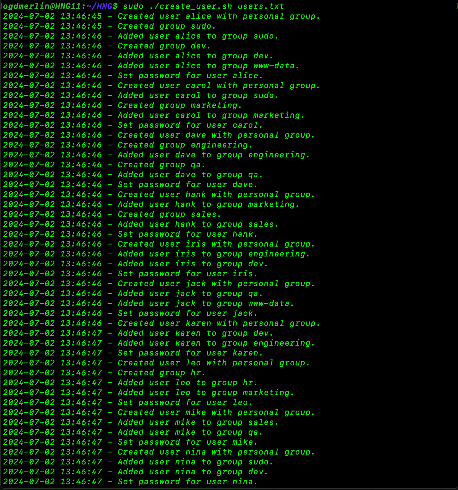
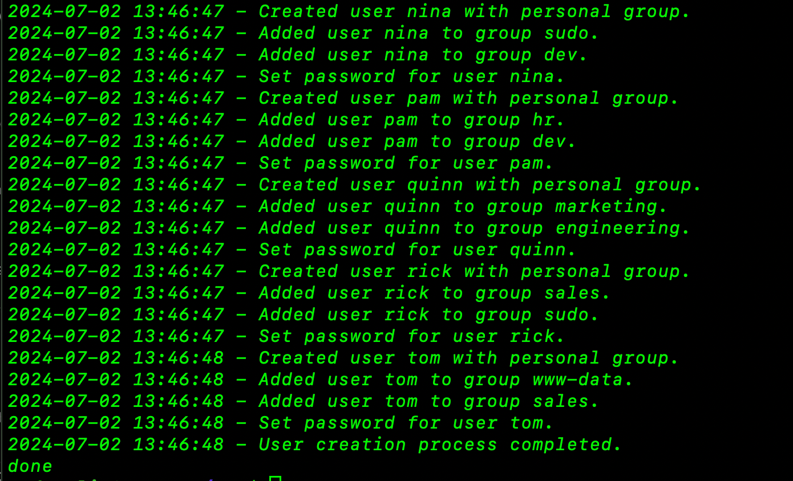
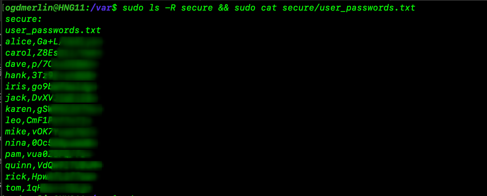

# Automating User and Group Management with Bash Scripts

**Overview**

This bash script automates the process of creating, deleting, and modifying users and groups on a Linux system. This script is designed to be run from the command line and takes user input to determine which action to perform.

**Needed Files;**

```
create_users.sh
```

```
users.txt
```

- `create_users.sh` is the main script that reads the `users.txt` file and creates users and groups based on the information provided in the file.

- `users.txt` is a sample input file that contains the list of users and their groups. Each line in the file contains the username and group name separated by a space.

#

Creating Users and Groups:

Prepare the `users.txt file`: This file should contain the list of users and their associated groups in the following format:

```
user1; group1,group2,group3
user2; group2, group1,
user3; group3
```

example:

```
frank; developers, hr, finance
sara;backend, developers
ogdmerlin; sudo, admin
```

2. Run the script: Run the `create_users.sh` script from the command line:

```
./create_users.sh users.txt
```

3. Verify the users and groups: After running the script, verify that the users and groups have been created correctly by checking the `/etc/passwd` and `/etc/group` files.



-

verify that our script run as expected.
cd into `/var/secure` where we placed our user and the random generated password for each user.


#

**Conclusion**

This script provides a simple and efficient way to manage users and groups on a Linux system. By automating the process, you can save time and reduce the risk of errors when performing these tasks.

**Learn More About HNG Internship**

To learn more about the HNG Internship program, visit the [HNG Tech website](https://hng.tech/).
